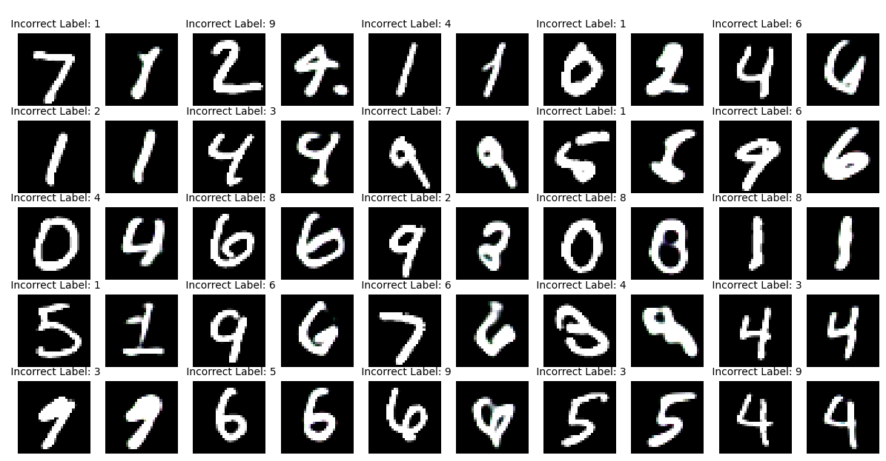
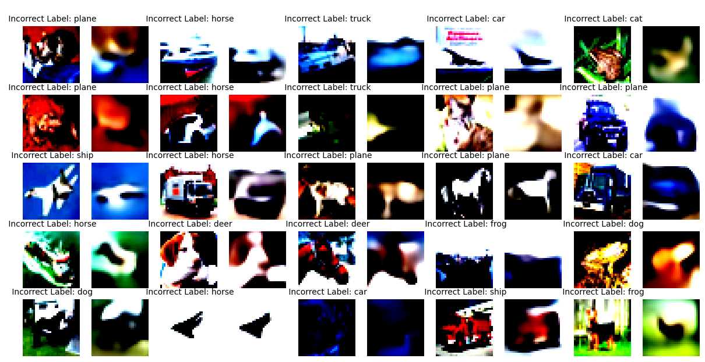

# PART 2 - VAE

# Task

1. Design a variation of a VAE that:

- takes in two inputs:
    - an MNIST image, and
    - its label (one hot encoded vector sent through an embedding layer)
- Training as you would train a VAE
- Now randomly send an MNIST image, but with a wrong label. Do this 25 times, and share what the VAE makes (25 images stacked in 1 image)!
- Now do this for CIFAR10 and share 25 images (1 stacked image)!

 

# Results

## MNIST

 

## CIFAR10

